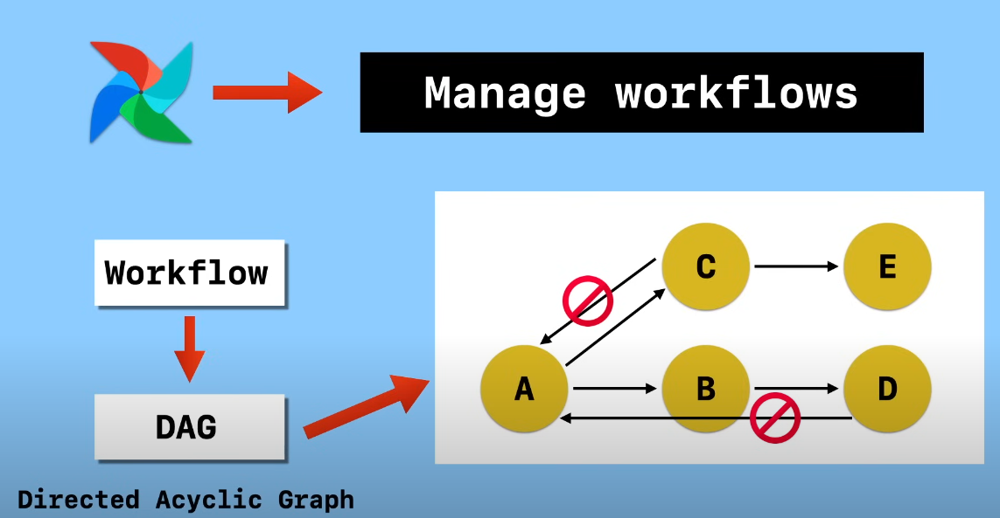
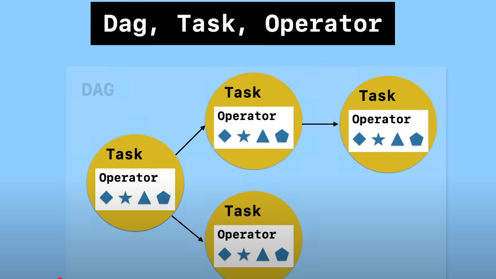

<!--  -->
</img> 
# airflow
<br>
For tutorial: 

https://www.youtube.com/watch?v=K9AnJ9_ZAXE&list=PLwFJcsJ61oujAqYpMp1kdUBcPG0sE0QMT


1.  What is `airflow` and why do we `need` it ?
    -   Airflow is a `workflow orchestration platform` that allows users to programmatically create, schedule, and monitor workflows.
            It's often used to automate machine learning tasks and create complex `data pipelines`. 

<!-- 
## Installation on local environment
1.  Specify the AIRFLOW_HOME dir 
<br>
For default behaviour  use 

```sh
export AIRFLOW_HOME=~/airflow
```
for using airflow in current directory use

```sh
export AIRFLOW_HOME=$(pwd)
```


2.  try method A or B
<br>
`method A`

    ```sh
    AIRFLOW_VERSION=2.10.4

    # Extract the version of Python you have installed. If you're currently using a Python version that is not supported by Airflow, you may want to set this manually.
    # See above for supported versions.
    PYTHON_VERSION="$(python -c 'import sys; print(f"{sys.version_info.major}.{sys.version_info.minor}")')"

    CONSTRAINT_URL="https://raw.githubusercontent.com/apache/airflow/constraints-${AIRFLOW_VERSION}/constraints-${PYTHON_VERSION}.txt"
    # For example this would install 2.10.4 with python 3.8: https://raw.githubusercontent.com/apache/airflow/constraints-2.10.4/constraints-3.8.txt

    pip install "apache-airflow==${AIRFLOW_VERSION}" --constraint "${CONSTRAINT_URL}"

    ```
Or, use 
<br>
`method B`

```sh
# this installs the requirement for airflow specified in requirement.txt
pip install -r requirements.txt
```


3. create `airflow.cfg` file and add the file
```sh
# add absolute Path to sqlite after //// slashes
[core]
sql_alchemy_conn = sqlite:////abs/path/to/project/dir/airflow.db
# replace abs/path/to/project/dir with absolute project path dir or dir where you want to create an airflow sqlite database
```

4.  Run Airflow Standalone:

    The airflow standalone command initializes the database, creates a user, and starts all component
    
```sh
airflow standalone
```

5. use this as cred (as it is shown in terminal after running step 4)
```sh
Login with username: admin  password: 7a4HAYQ2cmwDAHDy
```
for the UI interface goto (default)

http://localhost:8080 


6. for running the airflow scheduler, run the command in another terminal 
```sh
airflow sheduler
``` -->

Here's a well-structured guide for setting up Apache Airflow in a **virtual environment** and using the **current working directory (`.`) as `AIRFLOW_HOME`**.  

I'll also highlight the **commands that should go in `README.md`** for easy reference.  

---

# **🚀 Apache Airflow Local Setup Guide (Using Virtual Environment & Local Directory)**  

## **📌 Overview**  
This guide covers:  
✅ Installing Airflow inside a **Python virtual environment**  
✅ Using the **current directory (`.`) as `AIRFLOW_HOME`**  
✅ Running **Airflow webserver and scheduler**  
✅ Managing **DAGs and users**  

---

## **🛠️ Prerequisites**  
Ensure you have:  
- **Python 3.11** installed  
- **pip, venv, and other required system packages**  
- **Enough disk space and proper permissions**  

---

## **1️⃣ Install Dependencies (Before Setup)**
### ✅ **For Ubuntu/Debian**:
```bash
sudo apt update
sudo apt install python3.11 python3.11-venv python3.11-distutils python3-pip -y
```

### ✅ **For macOS (Using Homebrew)**:
```bash
brew install python@3.11
```

### ✅ **For Windows**:
1. Download **Python 3.11** from [python.org](https://www.python.org/downloads/).
2. During installation, **check the box**: **"Add Python to PATH"**.
3. Open **PowerShell** and run:
   ```powershell
   python -m ensurepip
   ```

---

## **2️⃣ Set Up Virtual Environment**  
🚀 **(Add These Commands to README.md)**
```bash
# Navigate to your project directory
cd ~/your-project-folder  # Change this to your actual folder

# Create and activate a virtual environment
python3.11 -m venv airflow-env
source airflow-env/bin/activate  # Linux/macOS
airflow-env\Scripts\activate     # Windows

# Verify Python version inside the virtual environment
python --version
```

---

## **3️⃣ Set `AIRFLOW_HOME` to Current Directory (`.`)**
🚀 **(Add These Commands to README.md)**
```bash
# Set Airflow to use the current directory
export AIRFLOW_HOME=$(pwd)  # Linux/macOS
set AIRFLOW_HOME=%cd%       # Windows

# Add this to your ~/.bashrc or ~/.zshrc to make it persistent
echo 'export AIRFLOW_HOME=$(pwd)' >> ~/.bashrc
source ~/.bashrc
```

---

## **4️⃣ Install Apache Airflow**
🚀 **(Add These Commands to README.md)**
```bash
pip install --upgrade pip
pip install apache-airflow==2.7.1
```

✅ **Verify Installation**  
```bash
airflow version
```

---

## **5️⃣ Initialize Airflow Database**
🚀 **(Add These Commands to README.md)**
```bash
airflow db init
```
This will create:  
- `airflow.cfg` → Airflow configuration file  
- `airflow.db` → SQLite database (for local use)  

✅ **Check if the files are created in the current directory**:  
```bash
ls -l | grep airflow
```

---

## **6️⃣ Start Airflow Webserver and Scheduler**
🚀 **(Add These Commands to README.md)**
```bash
# Start the Airflow web server (Runs on port 8080 by default)
airflow webserver --port 8080

# Open in browser: http://localhost:8080

# In a separate terminal, start the scheduler
airflow scheduler
```

---

## **7️⃣ Create an Admin User**
🚀 **(Add These Commands to README.md)**
```bash
airflow users create \
    --username admin \
    --firstname Admin \
    --lastname User \
    --role Admin \
    --email admin@example.com
```
🛠 **Now, log in to the Airflow UI at** `http://localhost:8080` **with the admin credentials.**

---

## **8️⃣ Add DAGs to `dags/` Directory**
🚀 **(Add These Commands to README.md)**
```bash
mkdir -p dags
```
- Place your DAG Python files inside the `dags/` directory.  
- Example DAG (`dags/example_dag.py`):
  ```python
  from airflow import DAG
  from airflow.operators.dummy import DummyOperator
  from datetime import datetime

  with DAG('example_dag', start_date=datetime(2024, 1, 1), schedule_interval="@daily") as dag:
      start = DummyOperator(task_id="start")

  ```

✅ **Activate DAGs in UI**:  
1. Start the scheduler:  
   ```bash
   airflow scheduler
   ```
2. Enable the DAG in **Airflow UI (`http://localhost:8080`)**.

---

## **9️⃣ Stop Airflow and Deactivate Virtual Environment**
🚀 **(Add These Commands to README.md)**
```bash
# Stop Airflow (Find and kill processes)
pkill -f "airflow webserver"
pkill -f "airflow scheduler"

# Deactivate virtual environment
deactivate
```

---

# **🚀 Summary of Commands for README.md**
```bash
# Install dependencies
sudo apt update
sudo apt install python3.11 python3.11-venv python3.11-distutils python3-pip -y

# Create and activate virtual environment
python3.11 -m venv airflow-env
source airflow-env/bin/activate  # (Linux/macOS)
airflow-env\Scripts\activate     # (Windows)

# Set AIRFLOW_HOME to current directory
export AIRFLOW_HOME=$(pwd)
echo 'export AIRFLOW_HOME=$(pwd)' >> ~/.bashrc
source ~/.bashrc

# Install Apache Airflow
pip install --upgrade pip
pip install apache-airflow==2.7.1

# Initialize Airflow database
airflow db init

# Start Airflow webserver and scheduler (run in separate terminals)
airflow webserver --port 8080
airflow scheduler

# Create an admin user
airflow users create \
    --username admin \
    --firstname Admin \
    --lastname User \
    --role Admin \
    --email admin@example.com

# Create DAGs directory
mkdir -p dags

# Stop Airflow and deactivate environment
pkill -f "airflow webserver"
pkill -f "airflow scheduler"
deactivate
```
---

# WORKFLOW IS SOMETHING LIKE

`WORKFLOW -> DAG(when to do what) -> TASK(what to do) -> OPERATOR (how to do)`



`DAG, tasks and operators`


`DAG, TASK AND OPERATORs internals`



# `TAST LIFECYCLE`
